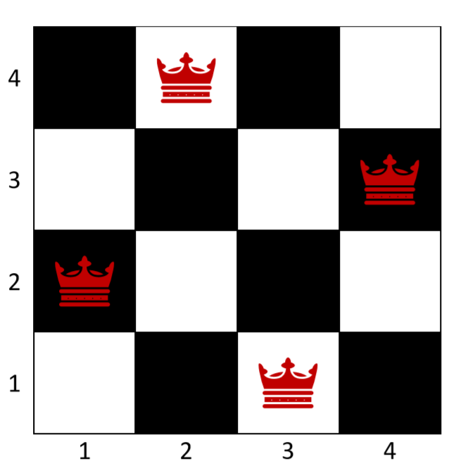

# Resolución del problema de N-QUEENS (N Reinas) en prolog
:office: Universidad de Huelva (UHU)  
:calendar: Curso 2019-2020  
:mortar_board: Representación del conocimiento  
:octocat: Ihar Myshkevich
  
## Introducción
El presente documento desarrolla la implementación de la resolución del problema de N-Reinas en Prolog. Para su desarrollo se ha tomado el código del problema 90  (Eight queens problem) de P-99: Ninety-Nine Prolog Problems  de Werner Hett. En este código están presentes dos implementaciones que se comentaran por separado.  
  
## Problema de las N-Reinas
El problema de las N-Reinas es un problema de ajedrez en el que se colocan N reinas en un tablero de N^2 posiciones sin que ninguna amenace a otra. El tablero de ajedrez estándar es de 8^2 posiciones, permitiendo así la colocación de 8 reinas sin que estas amenacen unas a otras. Pero su resolución se puede aplicar a tableros más pequeños y más grandes. Siendo el tablero mínimo de 4^2 posiciones con 4 reinas y sin un limite establecido para el mas grande, aparte del tiempo de computo.

  

  
## Predicados complementarios 
En este apartado se explicarán los predicados/declaraciones de los que se valen cada una de las implementaciones para resolver el problema.
