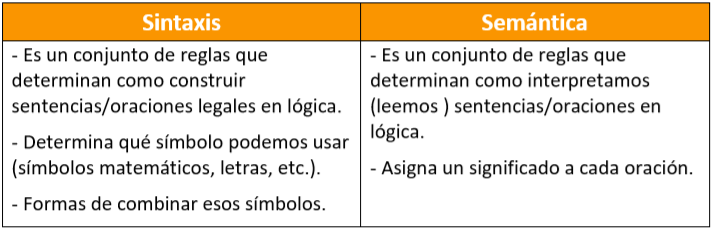
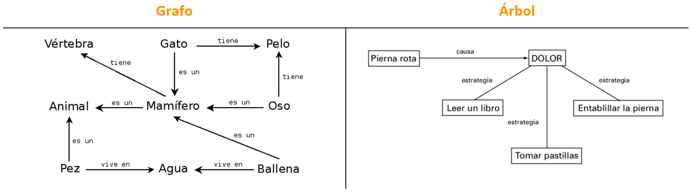
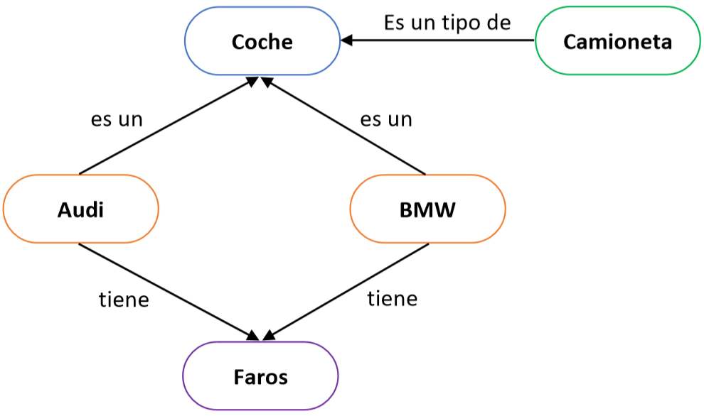
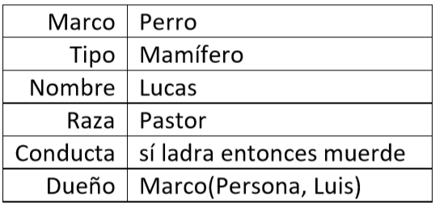
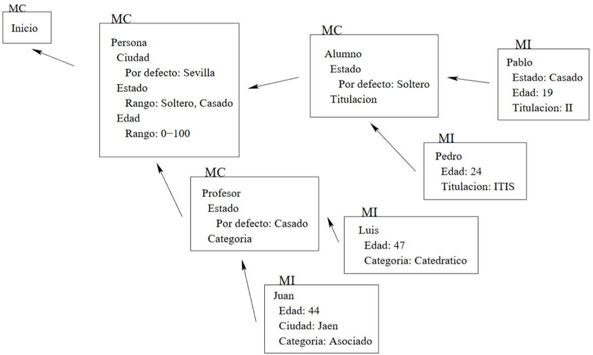

# Técnicas mas comunes de Representación del Conocimiento 
:office: Universidad de Huelva (UHU)  
:calendar: Curso 2019-2020  
:mortar_board: Representación del conocimiento  
:octocat: Ihar Myshkevich  
## Introducción  
En el presente documento se detallan las diferentes técnicas mas usadas en la representación del conocimiento aplicadas al área de la inteligencia artificial. 
Estas son utilizadas para transformar la información del mundo real en una estructura especifica para que la IA pueda resolver problemas en base a ella. 
Actualmente se pueden destacar cuatro. 
## Lógica
La representación del conocimiento usando la lógica consiste un lenguaje con representación inequívoca guiada por condiciones y reglas. Sus características principales son:  
* No presenta ambigüedad en su representación, pero si es susceptible a errores externos. 
* Permite una comunicación y procesamiento sin ambigüedad.
* Muy diferente a los leguajes naturales como el inglés o el español.

Como cualquier lengua, presenta una sintaxis y una semántica bien definida que permite traducir cualquier oración a la lógica.
```
Lenguaje Natural: “Todas las rosas tienen espinas” 
Lógica: ∀𝑋.(𝑟𝑜𝑠𝑎(𝑋) → ∃𝑌.(𝑡𝑖𝑒𝑛𝑒(𝑋,𝑌) ∧ 𝑒𝑠𝑝𝑖𝑛𝑎𝑠(𝑌))) 
   Para toda X: 
      Si (X es una rosa)
      Entonces existe un Y tal que
        (X tiene Y) y (Y son espinas) 
```
<p align="center">
  
</p>

### Ventajas
* La representación lógica ayuda a realizar el razonamiento lógico.
* Esta representación es la base de los lenguajes de programación. 

### Desventajas
* Las representaciones lógicas tienen algunas restricciones y son difíciles de trabajar.
* Esta técnica puede no ser muy natural, y la inferencia puede no ser muy eficiente.

## Redes semánticas
Las redes semánticas son una forma de representar el conocimiento basada en grafos. Estos constan de nodos que representan el objeto y arcos que describen la relación entre esos objetos. En el caso de que el grafo no presente ciclos, se puede visualizar como un árbol. Se usan principalmente para representar mapas conceptuales y mentales.  
Ejemplo:
<p align="center">
  
</p>

Esta representación consta de tres tipos de relaciones:
* Relación **IS-A** (es un/a): basada en herencia en la que el nodo origen representa una instancia concreta del nodo destino.
* Relación **KIND-OF** (es un tipo de): basada en una característica del nodo que se representa con otro nodo.
* Relación **HAS** (tiene): representa en una propiedad del nodo con otro nodo.  
<p align="center">
  
</p>

### Ventajas 
* Las redes semánticas son una representación natural del conocimiento.
* Transmite significado de manera transparente.
* Estas redes son simples y fáciles de entender.  
### Desventajas 
* Las redes semánticas toman más tiempo computacional en tiempo de ejecución.
* Además, estos son inadecuados ya que no tienen cuantificadores equivalentes.
* Estas redes no son inteligentes y dependen del creador del sistema.

## Marcos
Los marcos se parecen bastante a las estructuras usadas en c++. Estas contienen una colección de atributos y valores para describir una entidad en el mundo.  
<p align="center">
  
</p>

Un marco tomado de forma independiente raramente puede ser útil, en lugar de eso se suelen formar sistemas de marcos. Para ello se establece como valor de un atributo de un marco a otro marco. Estos presentan jerarquías, herencias (simple y múltiple), equiparaciones y gestión dinámica de valores. Lo que nos permite una completa representación del mundo.
<p align="center">
  
</p>

### Ventajas
* Facilidad de acceso a los datos relacionados.
* Fácil de representar. 
* Organización del conocimiento. 
* Capacidad de almacenar valores dinámicos. 

### Desventajas
* Alta probabilidad de errores en el mantenimiento de grandes sistemas de marcos. 
* Difícil acomodación a nuevas situaciones.
* Es una aproximación demasiado generalizada. 

## Reglas 
Otra de las posibles formas de representar el conocimiento es mediante reglas que presentan una serie de condiciones y acciones. El agente analiza estas condiciones y sin son ciertas ejecuta las acciones asociadas a esta regla. El proceso completo se llama *recognize-act cycle*.
```
si la luz del semáforo es verde y no hay peatones cruzando 
entonces 
   continúa la marcha 
sino  
   detén el coche
```
El sistema de reglas de producción consta de tres partes principales:
* El conjunto de reglas de producción.
* Memoria de trabajo. 
* recognize-act cycle. 

### Ventajas 
* Las reglas de producción se pueden expresar en cualquier tipo de lenguaje. 
* Muy fácil de representar en lógica. 
* Altamente modulares y se pueden eliminar o modificar fácilmente.

### Desventajas 
* No presenta aprendizaje.
* No almacena el resultado del problema para usos futuros. 
* Muy ineficiente en grandes sistemas. 

## Bibliografía 
Para el desarrollo del presente documento se han usado los siguientes enlaces:
* [Artificial Intelligence, Knowledge Representation](https://www.dsi.unive.it/~atorsell/AI/mod1-07-knowledge.pdf)
* [What is Knowledge Representation in AI? Techniques You Need To Know](https://www.edureka.co/blog/knowledge-representation-in-ai/)
* [Techniques of knowledge representation](https://www.javatpoint.com/ai-techniques-of-knowledge-representation)
* [REDES SEMÁNTICAS](https://sitiointeligenciaa.wordpress.com/redes-semanticas/)
* [Tema 3: Representacio´n del conocimiento estructurado](https://www.cs.us.es/cursos/ia2-2003/temas/tema-03.pdf)
* [Logica, Reglas de Producci´on y Representaciones Relacionales](https://ccc.inaoep.mx/~emorales/Cursos/InteligenciaArtificial/Acetatos/logregrel.pdf)
